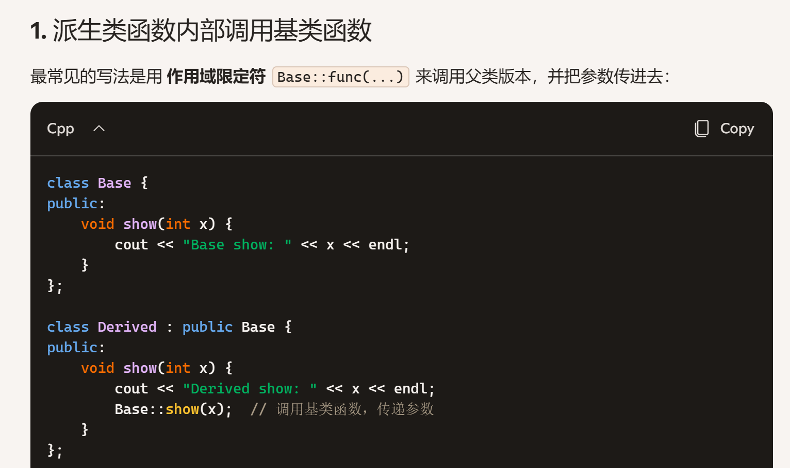
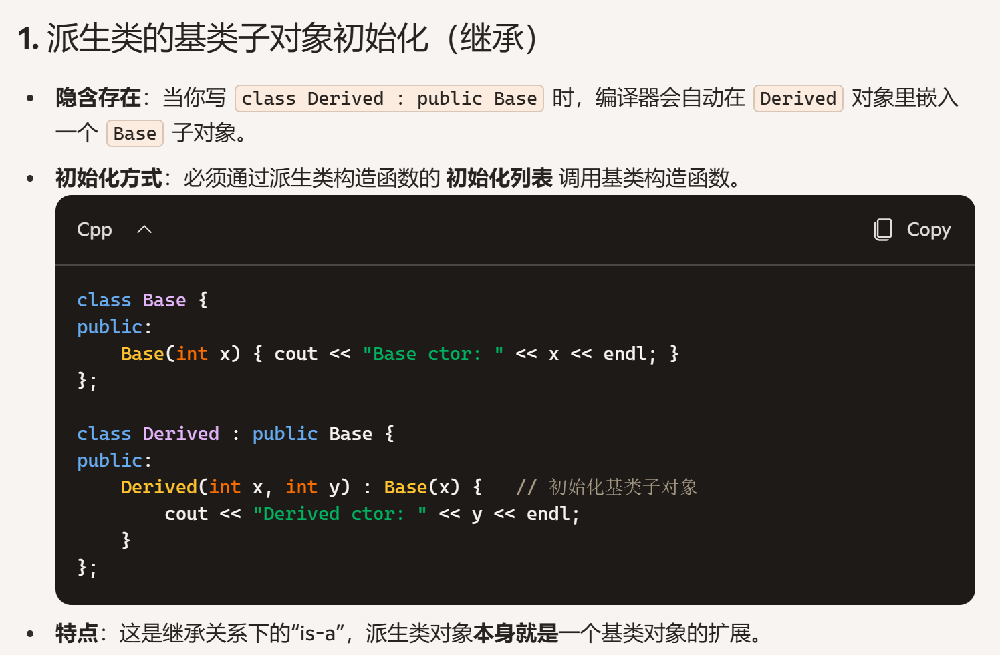
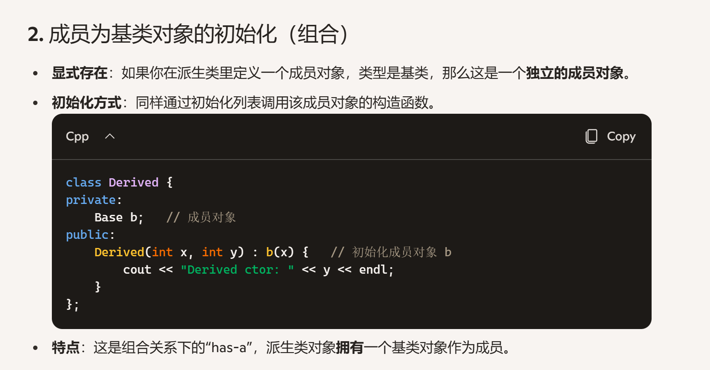
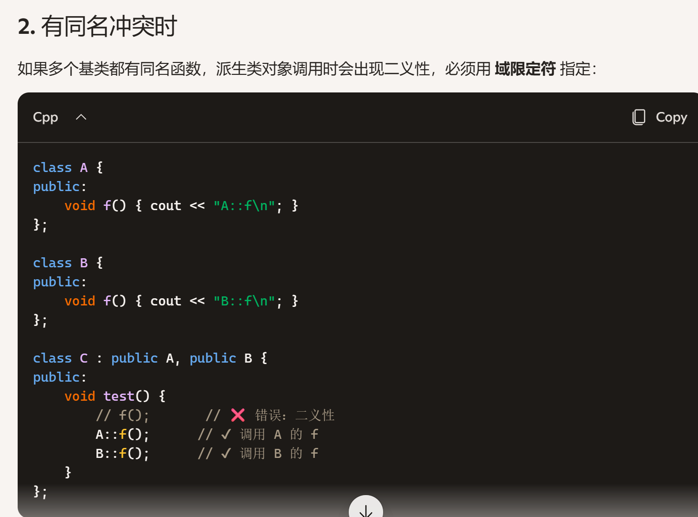
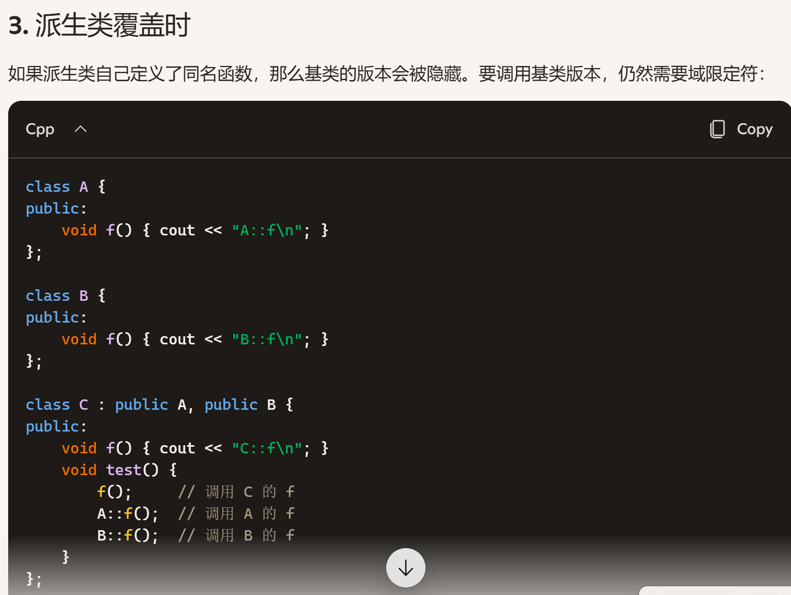
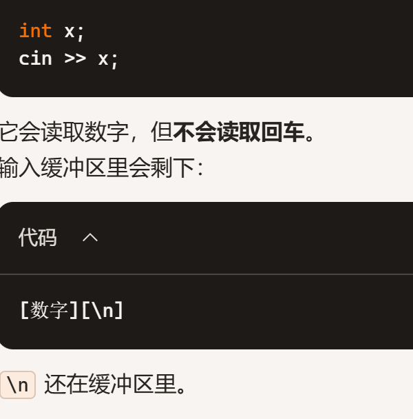
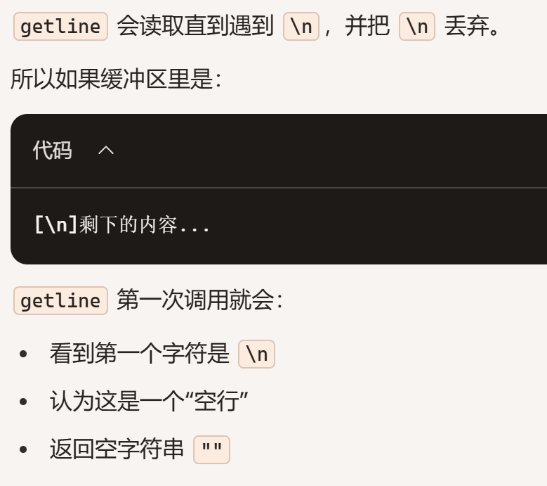
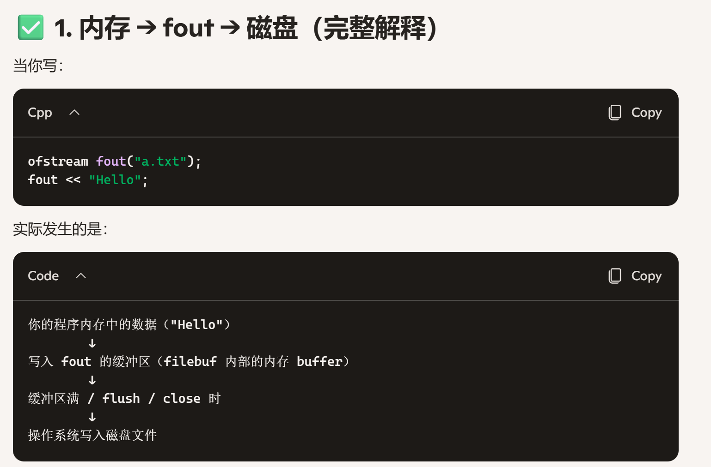
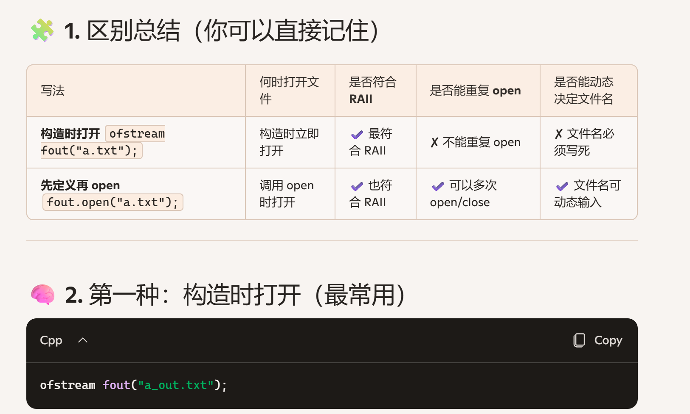

# 一， 类
- ## 定义 
``` cpp
    class Cname{// 类名
    public: //访问修饰，公，私
        int Student;//Xname 属性
        void eat(int s, int h); //方法函数声明

    };

    //访问用“ . ”
    Student Susan;
    Susan.eat()

    /*
    列如字符串类
    cin.set()
    st.length()
    标准库，--->自定义库

```
- ## 访问 .
  - 对象+.
  - 对象指针+ ->
  - this指针->（显式使用
    - 当成员变量和参数同名时
    - ```cpp
        class Circle {
        int radius;
          public:
              void setRadius(int radius) {
                  this->radius = radius; // 区分成员变量和参数
              }
          };
      ```
    - 返回当前对象时（链式调用）
    - ```cpp
          class Student {
          int score;
      public:
          Student& setScore(int s) {
              score = s;
              return *this; // 返回当前对象的引用
          }
      };

      Student stu;
      stu.setScore(90).setScore(95); // 链式调用
      ```
    - 在对象内部传递自身给其他函数
    - ```cpp
            void printStudent(const Student* s);

        class Student {
        public:
            void show() {
                printStudent(this); // 把当前对象传出去
            }
        };
      ```


- ## 不同类不能调用函数 ---》 与面向过程的区别 -- 》方便迁移，模块化
```cpp
class juxing{}
```
- 函数声明在类内，定义在类外，声明时可以初始化-》形参
- ## 类域
- ## 每一个对象都有一个指针(this指针)
  - r.Init(3,5)
  - (this).w= w-;
  - this-> h = h;
- ### 它可以让函数调用类的变量
- ### npy(s1,s2) --> s1.npy(s2) -->s1.npy(this,s2),感受到了参数个数由2变1，但实际仍有2个
```cpp
class Person {
public:
    string name;
    void set_name(string name) {
        // 这里的两个name，编译器怎么区分是参数还是对象的成员？
        name = name;  // 实际是把参数赋值给参数，对象的name没变化
    }
};

int main() {
    Person p;
    p.set_name("Tom");
    cout << p.name;  // 输出空字符串，因为赋值失败
    return 0;
}
//
void set_name(string name) {
    this->name = name;  // this指向当前对象，明确区分
}
```
- ## 私有private
   - 是否在类外可以直接访问，e.g.public可以通过一些接口间接访问，private则不行
   - 黑盒，例子：深宅大院的小姐
   - 仅供内部open
   - 默认私有
   - 可以通过set函数访问private

- ## protected
  - 有可知道，也有不能知道的
  
- ## 封装
- ## 继承
  - 在类的声明中对属性变量赋值，在以后调用可以当作默认值来使用
- ## 类实现
  - 类声明-》类实现

## 引用
  - &
  - 语法：int &b = a;定义了一个b，引用，他和a指向同一个内存位置，相当于a的一个别名
  - 常量引用：在参数列表中(const x & s)可以防止s被改变，突破可以用mutable
  - 特点：不是拷贝，直接改变变量，不能为null必须有真实值
## 类的

## 对象
## 对象的创建与消亡
- new delete --> 用户手动回收
- int a -->系统自动回收
  ```cpp
  class A{};
  A a1,a2;
  a2 = a1;
  A a3(a2);
  //等价 A a3 = a2
  //系统默认四大函数
  // 构造，析构，赋值运算符重载，拷贝函数
  ```
  ```cpp
    class A{};   // 一个空类

    A a1, a2;    // 调用默认构造函数，生成两个对象
    a2 = a1;     // 调用赋值运算符（operator=）
    A a3(a2);    // 调用拷贝构造函数
    // 等价于 A a3 = a2;
  ```
## 🛠 编译器自动默认生成的四大函数
  如果类中没有显式定义，编译器会自动生成以下函数：
  ### 1.默认构造函数（缺省的）

    默认版本：什么都不做。

    示例：A a1;
    缺省构造函数
    动态对象
    故意在类内定义--》速度inline函数

    参数初始化列表--》 将功能逻辑无关的提出，代码更干练
    缺省值
    构造函数公有
    不想让你看定义，缺省默认值放在声明里
    cin.getlin(c,80,/n)
  - 条件：类中没有定义任何构造函数时，编译器会自动生成一个无参构造函数。

  - 作用：用于对象的默认初始化。

  - 特点：

    内置类型成员不会自动初始化（值未定义）。

    类类型成员会调用它们自己的构造函数。

    等价代码：

  ```cpp
    A::A() {
        // 什么都不做，内置类型未初始化
        // 类成员会调用它们的默认构造函数
    }
  ```
  ### 2. 析构函数
  条件：如果没有显式定义，编译器会生成一个。

  作用：对象生命周期结束时自动调用，用于清理资源。

  默认行为：空函数体，什么都不做。

  等价代码：

```
  cpp
  A::~A() {
      // 内置类型成员无需处理
      // 类成员会自动调用它们的析构函数
  }
```
  ### 3. 拷贝构造函数
  - 条件：如果没有显式定义，编译器会生成一个。

  - 作用：用已有对象初始化新对象。

  - 默认行为：逐个成员变量拷贝（浅拷贝）。

  - 调用场景：

    A a2(a1);

    A a3 = a1;

  - 等价代码：

  ```cpp
    A::A(const A& other) {
        // 对每个成员执行拷贝
        this->x = other.x;
        this->y = other.y;
        this->s = other.s; // 类成员调用它们的拷贝构造
    }
  ```
### 4. 赋值运算符重载（operator=）
  - 条件：如果没有显式定义，编译器会生成一个。

  - 作用：把一个对象的值赋给另一个已存在的对象。

  - 默认行为：逐个成员变量拷贝（浅拷贝）。

  - 调用场景：

    a2 = a1;

  - 等价代码：

  ```cpp
    A& A::operator=(const A& other) {
        if (this != &other) { // 防止自赋值
            this->x = other.x;
            this->y = other.y;
            this->s = other.s; // 类成员调用它们的赋值运算符
        }
        return *this;
    }
  ```
  
## 🎯 总结
  ### 编译器会自动生成：默认构造函数、拷贝构造函数、赋值运算符、析构函数。

  ### 默认版本都是 浅拷贝。

  ## 如果类涉及 动态内存或资源管理，必须自己写构造函数、拷贝构造、赋值运算符和析构函数，否则会出现内存泄漏或重复释放的问题。
  - //~~函数-》临时变量
  - 指针不用构造函数
    int (*p)[5]	数组指针

  - delete[] a 到底是什么意思？
    delete[] = 命令：释放数组内存
    a = 告诉编译器：要释放谁？

  - 指针访问：p->getValue();
    (*p).getValue();等价

  - 二义性
  ```cpp
    Box boo//定义对象，调用默认构造函数
    Box boo(10,20)；//定义对象boo，调用传参构造函数
    Box boo();//声明了函数boo，参数为空，返还值类型为Box
    //矛盾，编译器读不懂

  ```
  ## 补充
  - ### 参数列表
    - 使用冒号 : 开始，后面跟一系列成员变量的初始化表达式。
    - 每个成员变量后面用括号 () 或大括号 {} 包裹初始化值。
  - 参数初始化列表：在参数列表里写
  - ### const
    - 常引用 ，常成员函数，常成员
  - ### 隐式转化
    - e.g
    - int a = 3.5,编译器会自动把double 先转换为int类型
  - ### 类型转换的写法
    - int (a),把a转化为int类型c++的写法
    - (int) a，把a转化为int类型c的写法

  ## 自定义四种函数
  - ### 构造函数
    - 从无到有都是构造函数，拷贝构造函数也是构造函数重载的一种形式
    - ```cpp
        class A{
          public:
            A(){}//默认
            A(T x){//自定义的
              a = x;
            }
        };
      ```
    - 
  - ### 析构函数
    - 语法：在类名前加 ~，没有返回值，也没有参数。
    - ```cpp
              class Example {
      public:
          Example* p = new Example();
          ~Example() {
              std::cout << "对象被销毁，资源释放\n";
          delete p;  // 调用 ~Example()
          }
      };

      ```
    - 未写的话自动调用默认的，离开作用域时，注意动态的不行，必须delete
  - ### 拷贝构造函数
  - ### 重载函数
  ## 返回值与临时对象
  ```cpp
        class A {
      public:
          A() { std::cout << "构造\n"; }
          A(const A&) { std::cout << "拷贝构造\n"; }
          ~A() { std::cout << "析构\n"; }
      };

      A foo() {
          A obj;
          return obj;  // 返回一个临时对象
      }

      int main() {
          A a = foo(); // 用返回值初始化 a
      }

  ```
  - return *this；
  - return 返回值在传统语义下会生成一个临时对象，用来传递结果
  - 生命周期：临时对象在表达式结束时销毁
  - 不能被修改：临时对象通常是右值，只能绑定到 const 引用，用const A&来接住
# 模板
template <class T>

# 函数重载
  ## 前置自增后置自增
  ```cpp
  class Age{
    int i;
    public:
    Age& operate++(){
      ++i;
      return *this;
    }
    const Age operate
  }
  ```
  return *this
  ## 输入输出流的重载
    stream
  ### 输出流cout<<
    ostream
  - ostream& operate<<(ostream& out, const Complex& obj);
  - 定义在类外，类内用友元声明

  ## 类型转换
  - 给默认值可以给无参缺参的类型转换
  - 二义性冲突：可以d
# 继承与派生
is a
继承由自己指向被继承
派生由派生的指向自己
 - 继承和派生都不能访问private
 - 父类是看不到子类的
 - 派生和继承没什么区别，从父类看子类是继承，从子类看父类是派生
## 派生
 - protected：家族可以访问
 - ```cpp
    class time:public Date{
      time(){}//构造函数也变了
    }
   ```
## 基类（父类）
 - ```cpp
    class Date{
      int year,month,day;
      Date()//构造函数
      print()
    }
   ```
## 继承
 - 用 作用域限定符 Base::func(...) 来调用父类版本，并把参数传进去
 - 
 - ```cpp
    class EourpDate:public Date{
      EDate()//构造函数变了，之前的划掉了，就算继承父类的也没用
      print()//Date里也有，且同名，但输出不一样，父类函数默认被隐藏了，只能调用当前的
      Date::print()//用父类的函数，此时可以

    }；

    //详细示例

    class Base {
      public:
          void show() { cout << "Base show\n"; }
      };

      class Derived : public Base {
      public:
          void show() { 
              cout << "Derived show\n";
              Base::show();  // 调用父类版本
          }
      };

   ```
 - 公有继承，public继承
   - 父类是什么权限，子类就继承什么权限。
     - ```cpp
        class Base {
          public:    int a;
          protected: int b;
          private:   int c;
          };

          class Derived : public Base {
          public:
              void f() {
                  a = 1;  // ✔ 可以
                  b = 2;  // ✔ 可以
                  c = 3;  // ❌ 不可以
              }
          };

       ```
       | 继承方式 | 子类对象 → 父类对象 | 父类对象 → 子类对象 | 说明 |
        | --- | --- | --- | --- |
        | **[public继承](ca://s?q=public继承赋值兼容性)** | ✔ 合法 | ❌ 不合法 | 子类 is-a 父类，保持“替代性” |
        | **[protected继承](ca://s?q=protected继承赋值兼容性)** | ❌ 不合法（类外不可见） | ❌ 不合法 | 父类成员在子类中变为 protected，外部无法直接赋值 |
        | **[private继承](ca://s?q=private继承赋值兼容性)** | ❌ 不合法（类外不可见） | ❌ 不合法 | 父类成员在子类中变为 private，完全封闭 |

        派生类的对象可以赋值给基类对象，b（父） = d（子）

        可以初始化基类引用，base & br = d

        派生类对象地址可以赋值给基类指针，base * pb = & d;

        | 场景 | 是否切片(切掉派生成员部分) | 是否支持多态 | 内存关系 |
        | --- | --- | --- | --- |
        | **对象赋值** ``Base ``b ``= ``d;`` | ✅ 切片 | ❌ 不支持 | 新建一个独立的 ``Base`` 对象 |
        | **基类引用** ``Base& ``br ``= ``d;`` | ❌ 不切片 | ✅ 支持 | 引用绑定到 ``d`` 的基类子对象 |
        | **基类指针** ``Base* ``pb ``= ``&d;`` | ❌ 不切片 | ✅ 支持 | 指针指向 ``d`` 的基类子对象 |
 - 保护继承
   - 父类的 public 和 protected 都变成 protected
   - ```cpp
      class Derived : protected Base {
        public:
            void f() {
                a = 1;  // ✔ 可以（但变成 protected）
                b = 2;  // ✔ 可以
                c = 3;  // ❌ 不可以
            }
        };

        Derived d;
        d.a;  // ❌ 不行，a 已经变成 protected

     ```
 - 私有继承
   - 父类的 public 和 protected 都变成子类的 private
   - 以后的子子代，都用不了，自此截断，不可派生了

 - ### 子对象
   - 派生类成员为基类对象
   - #### 初始化
   - 派生类的基类子对象初始化（继承
   - ```cpp
      class Base {
        public:
            Base(int x) { cout << "Base ctor: " << x << endl; }
        };

        class Derived : public Base {
        public:
            Derived(int x, int y) : Base(x) {   // 初始化基类子对象
                cout << "Derived ctor: " << y << endl;
            }
        };

     ```
   - 
   - 
 ```
    继承初始化：你在说“我就是一个 Base，只是我还多了一些东西”。

    成员对象初始化：你在说“我有一个 Base 成员，帮我做一部分工作”。

    👉 换句话说：

    继承时调用基类构造函数是为了初始化“自己身上的基类部分”。

    成员为基类对象时调用构造函数是为了初始化“自己拥有的另一个独立对象”。
 ```
 - ### 当一个 派生类对象 被创建时，构造函数的调用顺序是：

   - #### 基类子对象构造

        如果是继承，编译器会自动在派生类对象里嵌入一个基类子对象。

        派生类构造函数的初始化列表里必须先调用基类构造函数来初始化这部分。

        如果没有显式写，编译器会调用基类的默认构造函数。

 - #### 成员对象构造（子对象）

      派生类里定义的成员对象（包括基类类型的成员）会在基类构造完成后依次构造。

      顺序按照成员在类中 ***声明*** 的顺序，而不是初始化列表里的书写顺序。

 - #### 派生类自身构造

    最后执行派生类构造函数体，完成派生类自己的初始化逻辑。

 - #### 构造
 - ```cpp
    class Base {
      public:
          void print() { cout << "Base print" << endl; }
      };

      class Derived : public Base {
      public:
          void test() {
              print();  // 直接调用基类的 print
          }
      };

   ```
   因为 Derived 没有定义同名函数，print() 就解析到基类的版本。
  - ### 多层继承
  - 继承链条：子类继承父类，父类继承爷爷类。

   - 构造顺序：当子类对象被创建时，编译器会自动沿着继承链向上逐层构造：
   - 先构造父类，再子类成员类，再子类
   - 基类构造函数—对象成员构造函数—派生类本身的构造函数

      先构造最顶层的基类（爷爷类）。--> 再构造父类。--> 最后构造子类。

   - 调用规则：

      子类构造函数只负责告诉编译器：父类的基类子对象应该怎么初始化。

      父类构造函数里已经负责调用爷爷类的构造函数，所以子类不需要再去管爷爷类。
   - 派生类的构造函数的成员初始化列表中不能包含派生类对象的初始化
 - ### 多重继承
   ```派生名（总参数列表）：基类1（），基类3（），基类2（）{
    新增的
    }
   ```
   - 基类排序顺序随意，与声明有关
   - 
   - 
 - 菱形
   - 继承了，存在冗余，不佳而跨代访问，只能
 - 虚基类
   - 父类全部都都虚掉
### 存储
 - ❌ 不会创建两次对象空间
    ✔ 会在一个对象里包含一份父类子对象 + 子类自己的成员**

    也就是说：

    派生类对象只有“一块”连续的内存，但这块内存里包含了父类那部分 + 子类那部分。

    不是两个对象，也不是两次 new，也不是两块空间。
### 继承构造函数
 - 只能在子类外，用父类先构造，子类才能调用
 - 显示调用：Flybug(t):Bug()
 - 隐式调用：派生类中省略基类的构造函数，编译器自动调用基类的缺省构造.子类构造无法给父类构造传递参数
### 析构函数
 - 先子类析构，再子类成员，再父类析构

# 顺序
 - ### 一般先基类进行构造，然后再子类的成员进行构造，最后再进行子类自己的构造
# 聚集：不同的东西拼在一起，组合类，将很多类组合成了一个类

# 输入输出流
    输入设备：键盘
    输出设备：屏幕
    标准I/O：键盘--> 屏幕
    文件I/O：
    串I/O:
  - ## 流（stream）：信息从源到目端的流动
    - 数据；方向
    - 流入内存，输入流：读，cin >> a
    - 流出内存，输出流：写，cout << a
    ### 标准输入流
     - cin ---> 对象
     - cin //对应的大小空间就是缓冲区
     - cin 吃饭，但是遇到空格或者吃不完时，缓冲区还剩信息，再来cin，则继续吃剩下的，如果不想要剩下的，需要 **清流**
  
      #### cin 
        cin.get()//一次一个，对应c风格的putchar,不会跳过空格
        cin.getline(),cin.getline(str,5,'\n')，从当前缓冲区里读五个或终止条件，写入str
        cin.get().get()
        cin.read()
       - cin.get(ch,10,'\n')
       - 
       - 
       - 解决：加一个get()读走\n
       -  ✔ 会做的事
          读取“单词式”输入（遇到空格、换行就停）

          自动跳过前导空白字符（空格、\t、\n）

          对字符数组自动补 '\0'

          ❌ 不会做的事
          不会吃掉换行符 \n

          不会清空缓冲区

          结果
          使用 cin >> 后，缓冲区通常会残留一个 \n。
      #### getline()
       - cin.getline(ch,10,'\n')
       - string 下的：
         - getline(cin,s2)//无需识别大小，这里cin和前面的cin是同一个对象
  
              ✔ 会做的事
              按行读取：读取直到遇到 \n

              丢弃读到的 \n

              能读取空格、符号、整行文本

              内部自动补 '\0'（因为 string 本身以 '\0' 结尾）

              ❌ 不会做的事
              不会跳过前导空白（除非你用 ws）

              不会自动忽略缓冲区残留的 \n

              结果
              如果缓冲区里有残留的 \n，getline 会直接读到空行。
  #### clear()
  #### ignore()
  #### read()
    ### 标准输出流ostream
     - cout<<
     - cout.put().put()
     - cout.write()

  - 由流类定义的对象称为流对象
  - ## 流类(stream class)：

## 文件流
 - 文件流是 C++ 流体系的一部分，用来把“文件”当作一种输入/输出设备，就像 cin、cout 一样。
它们继承自 istream / ostream，因此支持 <<、>>、getline()、read()、write() 等操作。
 - fstream
 - ifstream表示输入
 - 输入和输出流均与缓冲区有关
 - 
 - 为什么文件流（ofstream/fstream）可以有多个，而且是用户自定义的，而 cout 却只有一个？
 - 开关文件：关联文件，切断连接
 - ```cpp
    ifstream fin("a_in.txt");
    ofstream fout("a_out.txt");
    int d;
    fin >> d;//从a.in文件读数据，进d
    fout << d;//从d里面把数据输出到a.out
   ```
 - 
 ### 模式open的模式
  - 3. 常见模式说明（你必须掌握）
      - 模式	含义
      - ios::out	写文件（默认会清空文件）
      - ios::in	读文件
      - ios::app	追加写入（不清空文件）
      - ios::binary	二进制模式
      - ios::ate	打开后定位到文件末尾
      - ios::trunc	清空文件（默认与 ios::out 一起）
 - (!fout)判断是否正常连接绑定文件
 ### close
  - 类比new和delete
```cpp
ofstream fout("a.txt");
fout << "Hello";
fout.close();   // 必须关闭

```

# 多态
## 静态多态
 - 编译时多态，通过 函数重载 和 运算符重载 实现。
 - 编译器在编译阶段决定调用哪个函数。
 - 示例：add(int a, int b) 与 add(double a, double b)。

## 动态多态
 - 运行时多态，通过 虚函数 (virtual) 和 继承 实现。
 - 编译时多态：依靠函数重载、运算符重载实现，编译阶段就确定调用哪个函数；
 - 运行时（动态）多态：依靠虚函数，通过基类指针 / 引用指向派生类对象，在程序运行时才确定具体调用哪个版本的函数。

 - 程序在运行时根据对象实际类型决定调用哪个函数。

 - 示例：基类 Animal 定义虚函数 speak()，派生类 Dog、Cat 重写该函数。通过基类指针调用时，会动态绑定到派生类版本。
 - 程序跑起来后才

### 虚函数
 - virtual可出现在类型前面或函数前，总之在函数名前就行
 - 同名函数前
 - 只需要在基类的函数声明处写一次
 - 子孙类都不需要继续声明，并且，其他的都不能成为非虚
 - 构造函数：绝对不能声明为虚函数。因为构造函数调用时子类对象还未完成构造，虚函数表还没初始化，无法实现多态调用。
 - 如果基类没有默认构造函数（即只定义了带形参的构造函数），派生类必须在自己的构造函数初始化列表中调用基类的带参构造函数，因此派生类需要声明带形参的构造函数来传递参数，否则编译会报错。这个叙述正确。

#### 虚析构函数
 - 通过 virtual 声明析构函数后，删除对象时会进行 动态绑定，确保派生类析构函数先执行，再执行基类析构函数。
 - A：错误，虚基类不强制要求定义虚析构函数，这不是语法强制规则。
 - B：普通析构函数在对象生命周期结束时就会释放资源，不是虚析构函数特有的作用。
 - C：正确，虚析构函数的核心作用就是在delete动态分配的派生类对象（通过基类指针操作）时，完整释放派生类资源。
 - D：明显错误，虚析构函数是 C++ 多态里非常关键的设计。

构造函数不能虚函数，分配对象绑定需要依赖对象的存在

#### 纯虚函数
 - 不存在函数体，只是有一个函数名，方便子类派生类调用
 - virtual 返回类型 函数名（参数列表） = 0；
 - 可加const